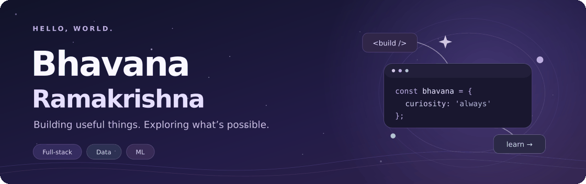
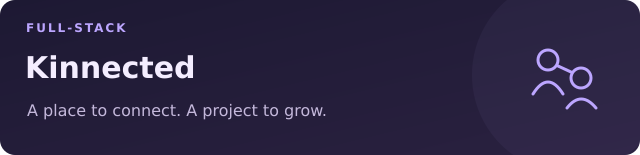
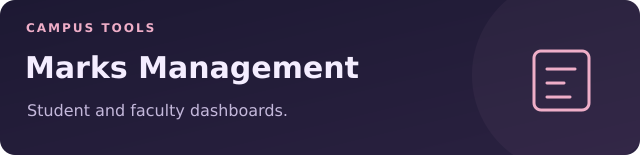
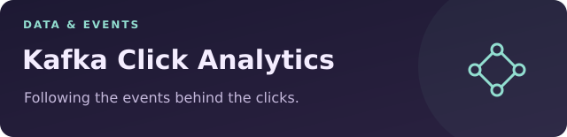
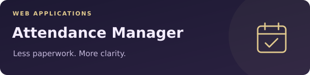

  

  <strong>Full-stack applications · Data engineering · Machine learning</strong> 
  Information Technology student at CBIT, Hyderabad

  <a href="https://kinnected-zeta.vercel.app">Try Kinnected</a> &nbsp;·&nbsp;
  <a href="https://marks-management-ruddy.vercel.app">Try Marks Management</a> &nbsp;·&nbsp;
  <a href="https://github.com/bhavanaramakrishna6?tab=repositories">Explore my repositories</a>

## A little about me

Hi, I'm Bhavana! I enjoy turning ideas into useful applications—from tools for students to social platforms and click analytics.

- **I build:** full-stack apps with React, TypeScript, Node.js and Python.
- **I'm exploring:** data engineering, event-driven systems and machine learning.
- **I also experiment:** with creative coding, 3D text and doodle-based games.

## A few things I've built

<table>
  <tr>
    <td width="50%" valign="top">
      
      
<strong>Kinnected</strong> A social networking app with login, registration and JWT authentication.

      
React · TypeScript · Node.js · Express · MongoDB

      
<a href="https://github.com/bhavanaramakrishna6/Kinnected">Code ↗</a> &nbsp;·&nbsp; <a href="https://kinnected-zeta.vercel.app">Live app ↗</a>

    </td>
    <td width="50%" valign="top">
      
      
<strong>Marks Management</strong> A marks management app with separate student and faculty dashboards.

      
React · JavaScript · Tailwind CSS · Vite

      
<a href="https://github.com/bhavanaramakrishna6/marks_management">Code ↗</a> &nbsp;·&nbsp; <a href="https://marks-management-ruddy.vercel.app">Live app ↗</a>

    </td>
  </tr>
  <tr>
    <td width="50%" valign="top">
      
      
<strong>Kafka Click Analytics</strong> A Flask click-tracking app with a Kafka consumer for per-user event counts.

      
Python · Flask · Apache Kafka

      
<a href="https://github.com/bhavanaramakrishna6/Kafka-Project">Code ↗</a>

    </td>
    <td width="50%" valign="top">
      
      
<strong>Attendance Manager</strong> A web app for adding classes, marking attendance and viewing attendance records.

      
React · JavaScript · Vite

      
<a href="https://github.com/bhavanaramakrishna6/attendance_marking_ssystem">Code ↗</a> &nbsp;·&nbsp; <a href="https://attendance-marking-ssystem.vercel.app">Live app ↗</a>

    </td>
  </tr>
</table>

## My toolbox

<strong>Languages</strong> 
   &nbsp;
   &nbsp;
   &nbsp;

<strong>Web & APIs</strong>     

<strong>Data & tools</strong>    

## Beyond the main projects

| Project | What I explored |
| --- | --- |
| [3D Text](https://github.com/bhavanaramakrishna6/3d-model) | Turning words into downloadable 3D text images. |
| [Doodle Characters](https://github.com/bhavanaramakrishna6/game_with_doodlecharacters) | An experiment in turning sketches into game characters. |
| [Machine Learning Notebooks](https://github.com/bhavanaramakrishna6/Bhavana-sML) | Coursework, assignments and experiments in ML and deep learning. |

  

